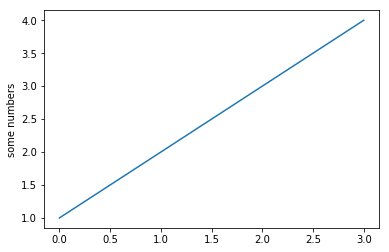
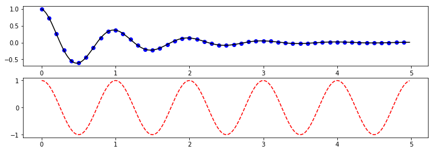
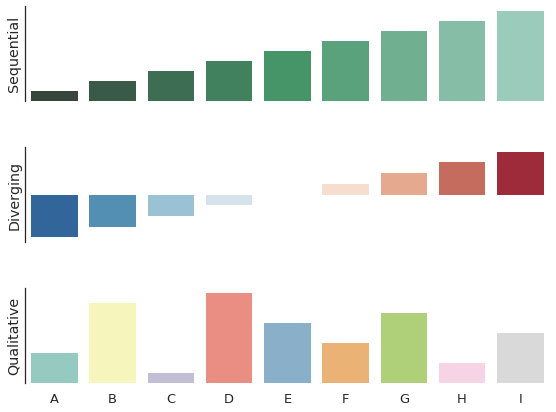
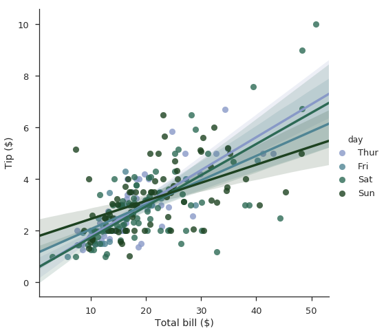

# Plotando com Matplotlib

Uma das grandes vantagens do Jupyter notebook é a possibilidade de gerar visualizações integradas com suas linhas de código. Essa possibilidade torna o notebook uma excelente ferramente para exploração e ciência de dados.

Como tutorial básico, vamos plotar alguns exemplos utilizando o Matplotlib, a biblioteca *de facto standard* de visualização do python.


```python
%matplotlib inline
# comando magico do jupyter para visualizações inline
import matplotlib.pyplot as plt # importamos a biblioteca

plt.plot([1,2,3,4]) # da os valores para serem exibidos
plt.ylabel('some numbers') # define a legenda no eixo y
plt.show() # exibe a figura
```





```python
import numpy as np
import matplotlib.pyplot as plt

# define a funçao a ser visualizada
def f(t):
    return np.exp(-t) * np.cos(2*np.pi*t)

# define as variaveis
t1 = np.arange(0.0, 5.0, 0.1) 
t2 = np.arange(0.0, 5.0, 0.02)

plt.figure(1, figsize=(12,4)) # define a figura e suas propriedades, como numero e tamanho
plt.subplot(211) # define o subplot
plt.plot(t1, f(t1), 'bo', t2, f(t2), 'k') # define os dadosda figura, tipo de linha, etc

plt.subplot(212)
plt.plot(t2, np.cos(2*np.pi*t2), 'r--')
plt.show() # mostra a figura
```





Outro exemplos podem ser encontrados na [documentação](http://matplotlib.org/index.html) e [galeria](http://matplotlib.org/gallery.html) do Matplotlib. Sua utilização é simples, e muito provavelmente você encontrará  a visualização que necessita praticamente pronta na galeria.

# Plotando com o Seaborn

O Seaborn é uma camada de alto nível sobre o matplotlib que facilita o trabalho de visualização.

Vamos a alguns exemplos:


```python
import numpy as np
import seaborn as sns
import matplotlib.pyplot as plt
sns.set(style="white", context="talk")
rs = np.random.RandomState(7)

# Cria e configura a figura
f, (ax1, ax2, ax3) = plt.subplots(3, 1, figsize=(8, 6), sharex=True)

# Gera dados para demonstraçao
x = np.array(list("ABCDEFGHI"))
y1 = np.arange(1, 10)
sns.barplot(x, y1, palette="BuGn_d", ax=ax1)
ax1.set_ylabel("Sequential")

# Trata dados
y2 = y1 - 5
sns.barplot(x, y2, palette="RdBu_r", ax=ax2)
ax2.set_ylabel("Diverging")

# Embaralha dados
y3 = rs.choice(y1, 9, replace=False)
sns.barplot(x, y3, palette="Set3", ax=ax3)
ax3.set_ylabel("Qualitative")

# Mostra a figura
sns.despine(bottom=True)
plt.setp(f.axes, yticks=[])
plt.tight_layout(h_pad=3)
```





```python
import seaborn as sns
sns.set(style="ticks", context="talk")

# Carrega dados de exemplo
tips = sns.load_dataset("tips")

# Cria uma paleta de cores especial
pal = sns.cubehelix_palette(4, 1.5, .75, light=.6, dark=.2)

# Plota os dados do dataset
g = sns.lmplot(x="total_bill", y="tip", hue="day", data=tips,
               palette=pal, size=7)

# Melhora as legendas
g.set_axis_labels("Total bill ($)", "Tip ($)")
```


    <seaborn.axisgrid.FacetGrid at 0x7fd126225160>





Assim como o Matplotlib, o Seaborn tem uma [documentação](https://seaborn.pydata.org/index.html) completa com [galeria de exemplos](https://seaborn.pydata.org/examples/index.html).
