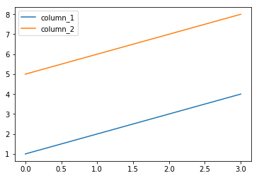

# Pandas

O [Pandas](http://pandas.pydata.org/) é o modulo preferido para anáise de dados em Python. Este modulo possui estruturas de dados como o DataFrame, que guarda informações e opera sobre elas de modo extremamente eficiente e intuitivo.


```python
import pandas as pd

df = pd.DataFrame(np.array([np.arange(9), np.arange(9,18)]).T, columns=['column_1', 'column_2'])
df.head()
```


<div>
<style scoped>
    .dataframe tbody tr th:only-of-type {
        vertical-align: middle;
    }

    .dataframe tbody tr th {
        vertical-align: top;
    }

    .dataframe thead th {
        text-align: right;
    }
</style>
<table border="1" class="dataframe">
  <thead>
    <tr style="text-align: right;">
      <th></th>
      <th>column_1</th>
      <th>column_2</th>
    </tr>
  </thead>
  <tbody>
    <tr>
      <th>0</th>
      <td>0</td>
      <td>9</td>
    </tr>
    <tr>
      <th>1</th>
      <td>1</td>
      <td>10</td>
    </tr>
    <tr>
      <th>2</th>
      <td>2</td>
      <td>11</td>
    </tr>
    <tr>
      <th>3</th>
      <td>3</td>
      <td>12</td>
    </tr>
    <tr>
      <th>4</th>
      <td>4</td>
      <td>13</td>
    </tr>
  </tbody>
</table>
</div>


O DataFrame possui uma infinidade de métodos úteis, estes podem ser encontrados na [documentação](http://pandas.pydata.org/pandas-docs/stable/generated/pandas.DataFrame.html). Com ele é fácil, por exemplo, selecionar os dados pertencentes a apenas uma coluna, da seguinte forma:


```python
df.column_1.values
```


    array([0, 1, 2, 3, 4, 5, 6, 7, 8])


Operações com os dados também são realizadas de forma facilitada:


```python
df.eval('column_1 * column_2')
```


    0      0
    1     10
    2     22
    3     36
    4     52
    5     70
    6     90
    7    112
    8    136
    dtype: int64


Outros objetos pythonicos podem ser transformados em DataFrames através dos metodos apropriados, como por exemplo:


```python
dict_df = {'column_1':[1,2,3,4], 'column_2':[5,6,7,8]}
dict_df
```


    {'column_1': [1, 2, 3, 4], 'column_2': [5, 6, 7, 8]}


```python
df_from_dict = pd.DataFrame().from_dict(dict_df)
df_from_dict
```


<div>
<style scoped>
    .dataframe tbody tr th:only-of-type {
        vertical-align: middle;
    }

    .dataframe tbody tr th {
        vertical-align: top;
    }

    .dataframe thead th {
        text-align: right;
    }
</style>
<table border="1" class="dataframe">
  <thead>
    <tr style="text-align: right;">
      <th></th>
      <th>column_1</th>
      <th>column_2</th>
    </tr>
  </thead>
  <tbody>
    <tr>
      <th>0</th>
      <td>1</td>
      <td>5</td>
    </tr>
    <tr>
      <th>1</th>
      <td>2</td>
      <td>6</td>
    </tr>
    <tr>
      <th>2</th>
      <td>3</td>
      <td>7</td>
    </tr>
    <tr>
      <th>3</th>
      <td>4</td>
      <td>8</td>
    </tr>
  </tbody>
</table>
</div>


Estatística é fácil com o pandas:


```python
df_from_dict.mean() # média
```


    column_1    2.5
    column_2    6.5
    dtype: float64


```python
df_from_dict.median() # mediana
```


    column_1    2.5
    column_2    6.5
    dtype: float64


```python
df_from_dict.var() # variância
```


    column_1    1.666667
    column_2    1.666667
    dtype: float64


```python
df_from_dict.describe() # descreve as distribuições em momentos estatísticos
```


<div>
<style scoped>
    .dataframe tbody tr th:only-of-type {
        vertical-align: middle;
    }

    .dataframe tbody tr th {
        vertical-align: top;
    }

    .dataframe thead th {
        text-align: right;
    }
</style>
<table border="1" class="dataframe">
  <thead>
    <tr style="text-align: right;">
      <th></th>
      <th>column_1</th>
      <th>column_2</th>
    </tr>
  </thead>
  <tbody>
    <tr>
      <th>count</th>
      <td>4.000000</td>
      <td>4.000000</td>
    </tr>
    <tr>
      <th>mean</th>
      <td>2.500000</td>
      <td>6.500000</td>
    </tr>
    <tr>
      <th>std</th>
      <td>1.290994</td>
      <td>1.290994</td>
    </tr>
    <tr>
      <th>min</th>
      <td>1.000000</td>
      <td>5.000000</td>
    </tr>
    <tr>
      <th>25%</th>
      <td>1.750000</td>
      <td>5.750000</td>
    </tr>
    <tr>
      <th>50%</th>
      <td>2.500000</td>
      <td>6.500000</td>
    </tr>
    <tr>
      <th>75%</th>
      <td>3.250000</td>
      <td>7.250000</td>
    </tr>
    <tr>
      <th>max</th>
      <td>4.000000</td>
      <td>8.000000</td>
    </tr>
  </tbody>
</table>
</div>


Para explorações rápidas, pode-se plotar os dados diretamente do DataFrame:


```python
%matplotlib inline
df_from_dict.plot()
```


    <matplotlib.axes._subplots.AxesSubplot at 0x7fd12844a7b8>





O pandas também possui a estrutura de dados "Series", que é extremamente útil quando deve-se lidar com dados temporais.
A [documentação completa](http://pandas.pydata.org/pandas-docs/stable/api.html) esclarece maiores informações sobre esse modulo tão poderoso. Gaste seu tempo aprendendo a lidar com o pandas, pois ele será um dos seus melhores amigos na hora de fazer análise de dados e resultados.
